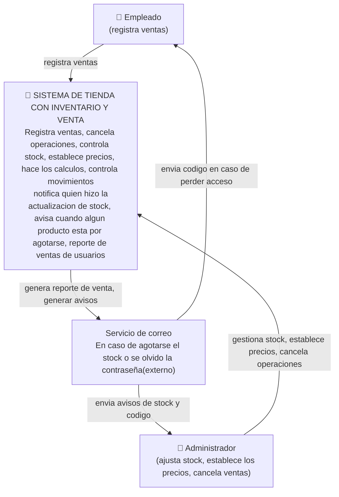

PRIMERA VERSION
#C4 caso de comercio - "Tienda de inventario y venta"

## NIVEL 1

**¿quién usa el sistema y con qué otros sistemas habla?**



## NIVEL 2 
# Tus contenedores ¿DONDE VIVE TU LOGICA?, ¿TU DB?, ¿TUS AVISOS?

```mermaid
    flowchart TB
        empleado["👤 Empleado"]
        admin["👤 Administrador"]

        subgraph sistema["🛒 SISTEMA DE TIENDA — VENTAS E INVENTARIO"]

            Sistema["Sitio Web<br>Interfaz de ventas, inventario y administración"]
            backend ["Backend / Node.js <br> JavaScript <br> logica del negocio"]
            base de datos ("Base de datos <br> MySQL <br> producto, categoria, venta, usuario, rol, detalle venta, movimiento stock")

```

## COMO SE CONECTA TODO LO QUE YA HICIMOS