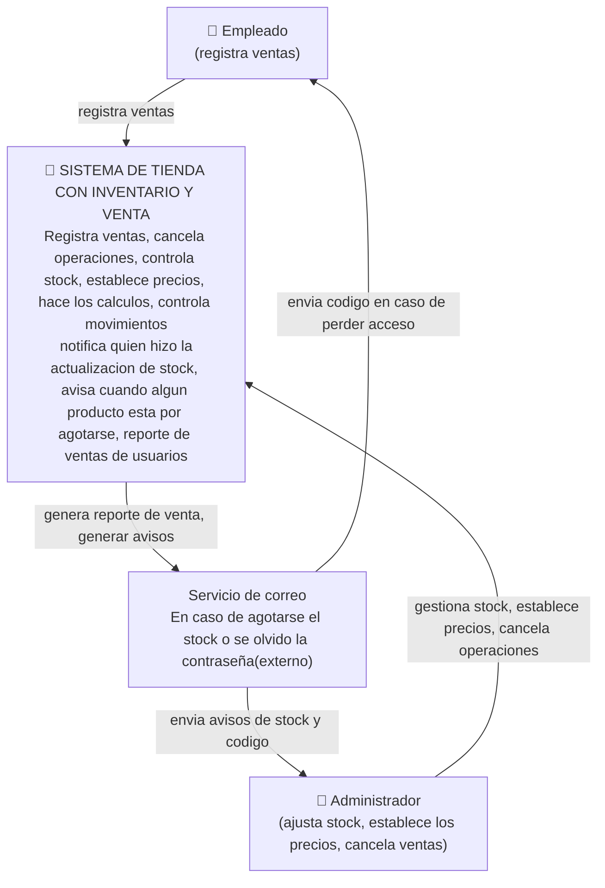
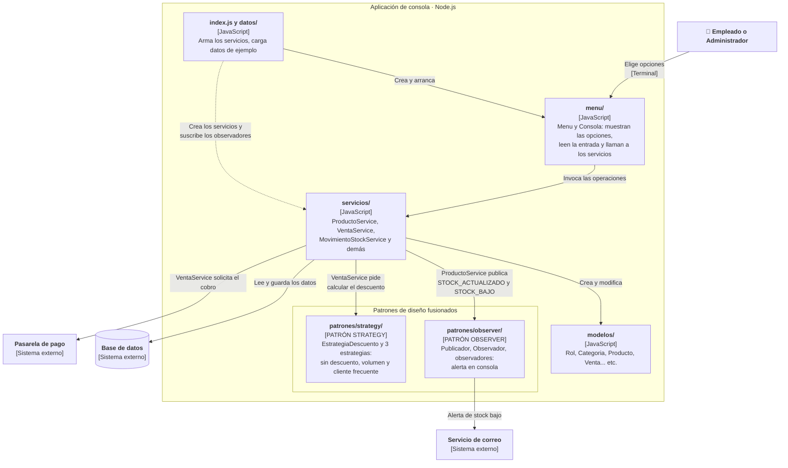

PRIMERA VERSION
#C4 caso de comercio - "Tienda de inventario y venta"
Sistema de consola en JavaScript (Node.js) para gestionar productos, stock, ventas y descuentos. Fusiona dos patrones de diseño: *Observer* (alertas y registro de stock) y *Strategy* (descuentos de venta). La decisión está documentada en (adr-001.md).

## NIVEL 1

**¿quién usa el sistema y con qué otros sistemas habla?**

## NIVEL 2 
# Tus contenedores ¿DONDE VIVE TU LOGICA?, ¿TU DB?, ¿TUS AVISOS?
Muestra el interior de la aplicación y *dónde viven los dos patrones*: `patrones/observer/` y `patrones/strategy/`.

